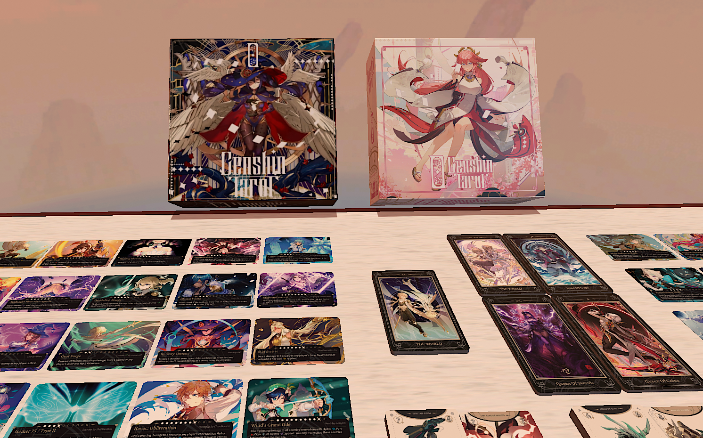

# My Games
--- 

I grew up with video and board games, so I have a wide variety of different ones I have played over the years that serve as both nostalgia... and sometimes 'trauma' (because of hard to beat levels or things that scared me as a kid). So, this is a little list of some of the games I've played over the years and my commentary (the years listed next to the games are not when I played them, just when the game was published).

These games impacted me in one way or another to pursue game development and design. 

---

## PS1 Games

### Tomb Raider (1996)

*"TombRaider" by Pierre F. is licensed under CC BY-NC-SA 2.0.*

I think this was one of the first games I ever played as a kid and I could never get past the cave level with the bear (I think that was level 1 which goes to show just how much I sucked). My dad bought a whole manual for the game (what used to be physical copies of detailed walkthroughs of games) and he himself has still yet to complete it. It's definitely a classic and nostalgic game-- it wins over the newer Tomb Raider games in that factor but the graphics of the new one beats the og by a ton (I will get to the newer one later on). This was my introduction to Lara Croft and the Tomb Raider series which I will forever be grateful for.

However, if you were to ask me anything about this game, I genuienly think the cave level with the bear is all I can tell you because that's what I spent the most time trying to beat and I don't think I ever did.

### Silent Hill (1999)

*custom cover uploaded to The Cover Project by BoubouV12*

This game was confusing to me when I first played it-- I think I was around 5 years old? All I remember is a scene where there was fog in a gated alleyway with brick walls and it was hard to see. I don't think I got too far into this one because my dad kept telling me how it freaked him out, which in turn freaked me out before I even touched the controller to play it. It's definitely a game I'd like to go back to just to enjoy the old graphics, but the remastered versions are great graphically. 

### Metal Gear Solid (1998)

*retail cover uploaded to The Cover Project by Dante Ali*

I was still too young to understand what I was doing but I remember both enjoying and being terrified of the alert sound. I also managed to get pretty far somehow but it's another one of those games where I only vividly remember one scene which in this case was a blue area with big shipment crates. My dad really enjoys this series and bought the remastered version for a different console many years later, though he hasn't played it yet and I haven't either.

### Spyro The Dragon (1998)

*custom cover uploaded to The Cover Project by Shenske*

This game had me use up so many memory cards on my PS1 because I was trying so hard to beat one of the bosses. Looking back it was really easy, I was just a kid with a small brain that didn't understand simple mechanics and just spammed things. My dad and I bought the remastered version of all 3 games in one for another console recently which I got to play for a bit. 

---

## PS2 Games

### Frogger: The Great Quest (2001)

*retail cover uploaded to The Cover Project by KaiserWAVE*

This game... was really scary to me as a kid ONLY because of the wasps. I always went back to it though because of the soundtrack and nostalgia. Also, the mechanics are so funny to look back at. Frogger's comnbat is punching and spitting while his gliding maneuver is inflating his vocal sac which makes a fun little noise while you glide him around. I also enjoyed the guidance from the Fairy Frog Mother and the little cutscene at the start. However, I don't think I ever finished it because the wasps were free roaming within the first level and they weren't killable so having to slip away and attack them often freaked me out because I didn't want to encounter them so I'd just hide in the water. I would definitely beat it if I were to go back and play it. Looking back at the gameplay, I feel kind of stupid for freaking out over the wasps as a kid, lol.

### Dance Dance Revolution: Disney Channel Edition (2008)

*game box shot uploaded to GameFAQs by MuddyMaestro*

Before Just Dance, there was DDR. I specificially had the Disney Channel Edition which was peak. I still have the DDR mats with the arrows on it that we would have to connect to the PS2 by wire and sometimes it wouldn't register when you step on it so we'd have to stomp on the mat. I spent a lot of time playing this game and it was as close as I'd get to Guitar Hero back then (since it was and still is more expensive). I tried playing DDR in an arcade this past year and failed miserably so either I was delusional as a kid or I'm out of touch. This was definitely a big part of my time with the PS2.

---

## Xbox One Games

### Assassin's Creed IV: Black Flag (2013)

*custom cover uploaded to The Cover Project by segamer*

When my dad got us this console, it came predownloaded with both Black Flag and Unity. Both Assassin's Creed Games became the first newer console games I had played. Although I didn't enjoy this one as much as Unity, I really liked the whistle taunt and the music! I abused the whistling a lot for the fun of it.

### Assassin's Creed: Unity (2014)

*custom cover uploaded to The Cover Project by segamer*

I enjoyed Unity a lot more than Black Flag and I think it was due more to the aesthetic and era this game took place in. I never beat it but I spent many hours in this game pursuing side quests

### Forza Motorsport 5 (2013)

*retail cover uploaded to The Cover Project by segamer*

Became one of my go-to games on this console! Needed to play something but not in the mood for anything specific? This was the game. I still have replays saved dating back to 2014 of crashing into other vehicles or drifting. This was a game I enjoyed taking turns to play with my dad-- watching him bump into walls and driving the wrong way after losing control of the car, etc. I know there's better games in the series but this was the only one I had experience with and it was great. The menu ambience is the first thing that pops into my head when I think of this game. 

### Rise of the Tomb Raider (2015)

*retail cover uploaded to The Cover Project by segamer*

I remember how hyped up my dad and I were when this game was announced to be released. We bought it as soon as we could and got to playing it and admiring the new and realistic graphics. It was so cool to see Lara Croft in good graphics and the entire game with a bigger story and quests. 

## Overcooked! All You Can Eat (2020)

---

## Nintendo DS/3DS

### Animal Crossing New Leaf (2012)

*retail cover uploaded to The Cover Project by MrMoustacheMan*

### Tomodachi Life (2013)

*retail cover uploaded to The Cover Project by MrMoustacheMan*

---

## Board Games

### Eldritch Horror (2013)
/pic2272163.jpg)
- [Link to the Game](https://boardgamegeek.com/boardgame/146021/eldritch-horror)

PEAK BOARD GAME. It has a bit of a difficult learning curve but once I learned it, I absolutely love it. From the design to the mechanics, it's so engaging and can take up to 4 hours or possibly more. You have to plan out your actions before doing them so you and your team can have the best outcome and win. There are two main challenges at play such as preventing the awakening of the Ancient One (the final boss), Mysteries (3 challenges that need to be solved in order to end the game before the Ancient One is awakened). In order to successfully progress to the end of the game, players need to gather clues which are used to solve the Mysteries, defeat monsters because an overflow of a certain amount can lead to an early awakening, closing gates which spawns the monsters, and the actual act of fighting monsters using your skills. There are about 50 or so investigators to choose from, each with a different skill amount, starting point and assets. 

### Arkham Horror (Third Edition - 2018)
/pic4552467.jpg)
- [Link to the Game](https://boardgamegeek.com/boardgame/257499/arkham-horror-third-edition)

### Luthier (2025)
/pic7893660.jpg)
- [Link to the Game](https://boardgamegeek.com/boardgame/371330/luthier)

### Sherlock Holmes Consulting Detective: Jack the Ripper & West End Adventures (2016)
:strip_icc()/pic5363890.png)
- [Link to the Game](https://boardgamegeek.com/boardgame/204305/sherlock-holmes-consulting-detective-jack-the-ripp)

### Detective: A Modern Crime Board Game (2018)
:strip_icc()/pic5038180.jpg)
- [Link to the Game](https://boardgamegeek.com/boardgame/223321/detective-a-modern-crime-board-game)

### Genshin Tarot (2022)

- [Link to the Game](https://boardgamegeek.com/boardgame/346643/genshin-tarot)

I know, Genshin Impact... This is way better than the actual video game in my opinion. I can play this board game for hours with all new characters. there's a bit of a learning curve but it's a really fun fan made board game. The visuals are great and all fanart while the mechanics of the game are really fun and engaging.

